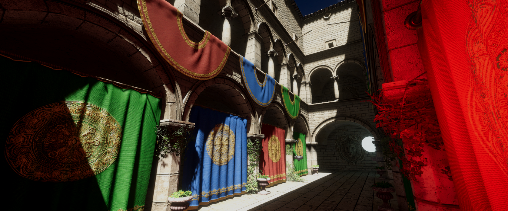

# RTX Global Illumination in Unity



## Introduction

This respository is [RTXGI-DDGI](https://github.com/NVIDIAGameWorks/RTXGI-DDGI?tab=readme-ov-file) implementation in Unity 2022.3.17f1c1 with URP14.0.9

It use Microsoft DirectX Raytracing to trace ray from each probe to scene geometry, grab irradiance and evaluate into texture

## System Requirements

This renderer feature need DXR capable GPU, and you need to enable DirectX12 Graphics API on Windows in unity

## Limitations

This is more like a demostration, we have some limitations here.

- Only DirectX12 API is supported on Windows
- Only one probe volume supported
- We use FindObjectsOfType to grab scene lights in each frame, it may be expensive
- Transparent object is not tested at this version

## Warning

- **This feature is only tested on NVIDIA Cards (NVIDIA Geforce RTX 4070 Ti)**

- Probe Variability Feature is **expermential**, it dont support emissive materials, it means if you change emissive object, illumination will keep as converged.

- You may got bug like this (scene suddenly got full black), i think it's because of Shader Keywords, but i haven't solved it yet.

  

  - This bug will not appear at playing state
  - If you got it, you can click Volume->DDGI->Refresh DDGI Settings, or just change code in `LitRaytracingForwardPass.hlsl`:

```glsl
// Raw code
#ifdef DDGI_SHOW_INDIRECT_ONLY
    color.rgb           = indirectLighting;
#elif DDGI_SHOW_PURE_INDIRECT_RADIANCE
    color.rgb           = indirectRadiance;
#else
    color.rgb           += indirectLighting;
#endif

// Changed code (skip keywords)
color.rgb += indirectLighting;
```

## Third Party

- [LWGUI](https://github.com/JasonMa0012/LWGUI)
- [Unity Sponza](https://github.com/Unity-Technologies/Classic-Sponza)

## Reference

- [NVIDIA-RTXGI-DDGI](https://github.com/NVIDIAGameWorks/RTXGI-DDGI?tab=readme-ov-file)
- [Adria-DX12](https://github.com/mateeeeeee/Adria-DX12)
